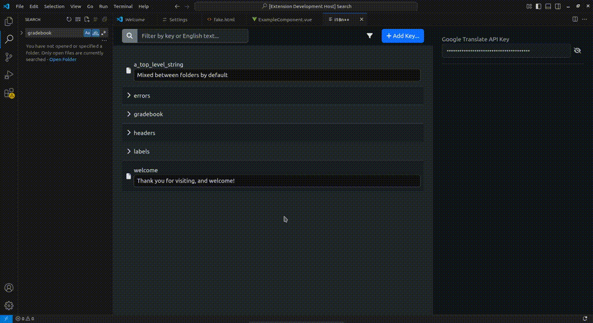

# i18n++

This is a simple extension for VSCode that allows users to
manage their translation files, and also has a feature that
lets users search existing files for literal text (e.g. "where
on this page is a key used that translated to Save Changes").

# Previews

> Search component files for literal text


> Hover translation keys to see literal text in tooltip


> Manage translations and use Google Translate to translate into other languages



# Requirements

* Your translation literal files (e.g. en.json, es.json, fr.json...) are stored in a single folder.

> Make sure to configure the extension settings for i18n++ to point
> to this folder.

* Your translation literal files are in a simple key/value format, meaning they look something like this:

```
{
    "errors": {
        "missing_username": "Username is missing!"
    }
}
```

* (Optional) Google API translate key

> If you wish to use google's translate api to generate machine translations
> of your strings, you must provide a valid google translate api key.

* (Optional) Your translation literal files are part of a git repo.

> If your literal files are tracked in a git repo, then you can take advantage
> of the "Only New" filter functionality within the extension.

# Usage

Launch i18n++ from the "Show all Commands" picker.

You can also launch the "search in current file" (i.e. "Quick Search") from the
command palette.  It's recommended that you assign this to your preferred
keyboard shortcut (F3 can be a good option for this).

# Known issues

- English is hard-coded as the "default" language.
- There may be some color theme issues, particularly for users not using dark mode.